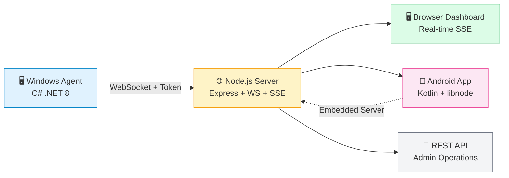
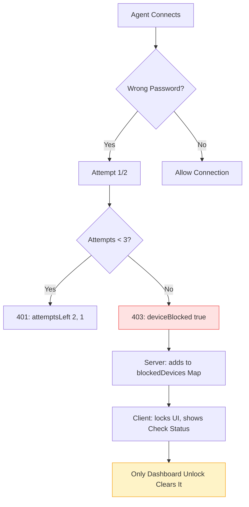
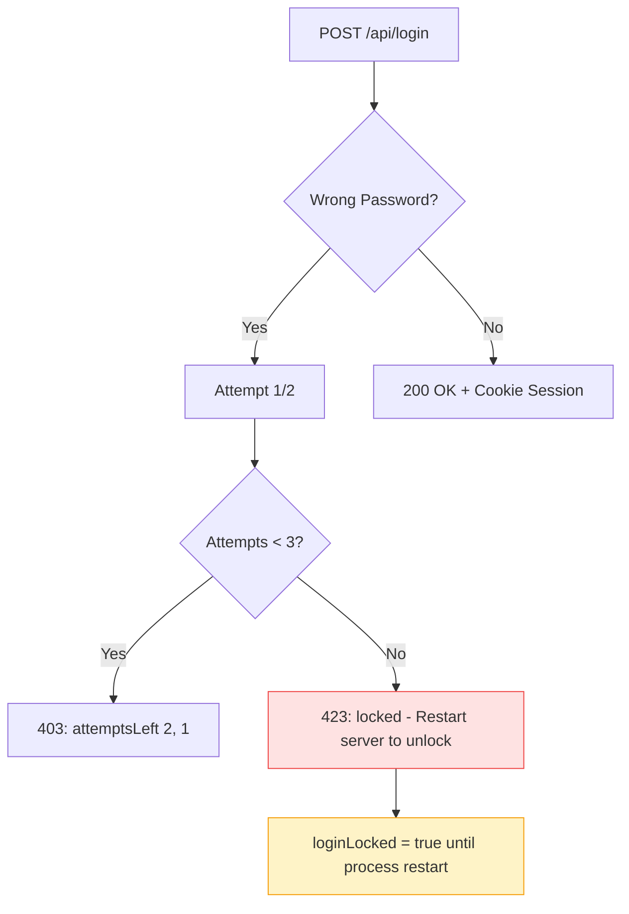

<p align="center">
  <a href="https://render.com/deploy?repo=https://github.com/4sudosu/WinSysMonitor">
    
  </a>
  <br><br>
  <a href="https://github.com/4sudosu/WinSysMonitor/releases/latest">
    
  </a>
  <a href="https://github.com/4sudosu/WinSysMonitor/actions/workflows/android-release.yml">
    
  </a>
  <a href="https://github.com/4sudosu/WinSysMonitor/blob/main/LICENSE">
    
  </a>
  <a href="https://t.me/verifiedharyanvi">
    
  </a>
  <a href="https://github.com/4sudosu/WinSysMonitor/stargazers">
    
  </a>
  <a href="https://github.com/4sudosu/WinSysMonitor/forks">
    
  </a>
</p>

---

# 📡 WinSysMonitor — LAN System Monitoring

> **Monitor every Windows machine on your network from your phone or browser — no internet, no cloud, no subscription.**

A complete LAN monitoring system: lightweight Windows agents connect to a self-hosted Node.js server over WebSocket, serving a beautiful real-time dashboard. A native Kotlin Android app (with embedded Node.js runtime) lets you manage devices, capture live screenshots, and receive instant connect alerts — all on your local network.

---

## 🏗️ Architecture

### System Overview

| Component | Technology | Purpose |
|-----------|------------|---------|
| **Windows Agent** | C# (.NET 8) | 24×7 service, WebSocket client, hardware monitoring, screenshots |
| **Node.js Server** | Express + WS + SSE | Real-time dashboard, agent management, REST API, auth |
| **Web Dashboard** | HTML/CSS/JS | 10 themes, live device grid, screenshot viewer, admin panel |
| **Android App** | Kotlin + Material 3 | Native UI, embedded server, notifications, 10 themes |

### Data Flow



> 📱 **Phone can ALSO host the server** — Start Server → `0.0.0.0` (LAN) or `127.0.0.1` (local)

---

## 📸 Screenshots

### 📱 Android App — Native Kotlin + Material 3

<div align="center">

| Launcher | Devices | Device Detail | Settings |
|:--------:|:-------:|:-------------:|:--------:|
|  |  |  |  |

</div>

### 🎨 Theme Gallery

| Theme | Preview |
|-------|---------|
| Midnight Ocean | `#0f172a` `#06b6d4` |
| Aurora | `#0c1a2b` `#22d3ee` |
| Solar Flare | `#2c1a00` `#fbbf24` |
| Cyberpunk | `#0a0a1a` `#a855f7` |
| Royal Purple | `#1a0a2e` `#c084fc` |
| Forest Calm | `#0a1a0a` `#22c55e` |
| Slate Pro | `#18181b` `#71717a` |
| Paper Light | `#fafafa` `#3b82f6` |
| Mint Fresh | `#f0fdf4` `#10b981` |
| Rose Blush | `#fdf2f8` `#ec4899` |

---

## ✨ Features

<div align="center">

| 📱 Android App | 🖥️ Windows Agent | 🌐 Server & Dashboard | 🔐 Security |
|:---:|:---:|:---:|:---:|
| Native Kotlin + Material 3 | 24×7 Windows Service | Real-time SSE Updates | Token-based Agent Auth |
| Embedded Node.js Runtime | Silent Installer + ACL | 10 Beautiful Themes | 3-Strike Device Block |
| 10 Themes + 6 Icons | Config Auto-Reload | Admin Cookie Sessions | Brute-Force Protection |
| Live Screenshots | Secure GDI Capture | REST Admin API | TLS/WSS Support |

</div>

### 📱 Android App — Native Experience

| Feature | Description |
|---------|-------------|
| 🚀 **Mandatory Update Gate** | Checks GitHub releases on startup, blocks UI until verified |
| 🎨 **Native Material 3 UI** | Kotlin + Jetpack Compose — no WebView for main flow |
| 📡 **Live Device List** | Real-time SSE updates, search/filter by hostname, IP, serial, model |
| 📸 **Screenshot Capture** | One-tap full-screen capture, zoom/pan, save/copy/share |
| ⏱️ **Auto-Refresh** | Configurable 3s / 5s / 10s per device |
| 🔔 **Connect Alerts** | Native notification + custom sound/icon when agent connects |
| 🌈 **10 Themes** | Midnight Ocean, Aurora, Solar Flare, Cyberpunk, Royal Purple, Forest Calm, Slate Pro, Paper Light, Mint Fresh, Rose Blush |
| 🎯 **6 Launcher Icons** | Default, Emerald, Violet, Rose, Amber, Ocean (adaptive) |
| 🔊 **Custom Notifications** | Pick tone (system/chime/alert/ding/soft/custom) + icon |
| 🏠 **Host or Connect** | Run server on phone (`127.0.0.1` or `0.0.0.0`) or connect to external |

### 🖥️ Windows Agent — Enterprise Grade

| Feature | Description |
|---------|-------------|
| ⚙️ **24×7 Windows Service** | Runs as LocalSystem, auto-restart on crash (`sc failure`) |
| 🤫 **Silent Install** | `/VERYSILENT /SERVERIP=x /SERVERPORT=y /SERVERTOKEN=z` |
| 🔄 **Config Auto-Reload** | Edit `agent.config.json` → agent reconnects instantly |
| 🔒 **Config ACL Lock** | `icacls` → only SYSTEM + Admins can modify |
| 📷 **Secure Screenshots** | Scheduled task in user session (no Service Desktop access) |
| 🎯 **Dual Capture** | Direct GDI first, fallback to PowerShell interactive |

### 🌐 Server & Dashboard — Real-time Control

| Feature | Description |
|---------|-------------|
| ⚡ **Real-time SSE** | Live agent connect/disconnect, device list updates |
| 🎨 **10 Dashboard Themes** | Matches Android themes, persists in localStorage |
| 🔐 **Admin Auth** | Cookie sessions (7-day) + `X-Admin-Password` header |
| 🛡️ **Brute-Force Protection** | 3 failed logins → server locks until restart |
| 🚫 **Device Blocking** | 3-strike strict block (passwords ignored while blocked) |
| 📸 **Screenshot API** | `POST /api/monitor/:machine/screenshot` → base64 PNG |
| ⚙️ **Config API** | `/api/config` for server info, `/api/agents` for device list |
| 🌐 **CORS/Origin Control** | Locked to configured origins |
| 📦 **Payload Limits** | 200MB max for screenshots |

### 🔐 Security — Defense in Depth

| Layer | Implementation |
|-------|----------------|
| 🔑 **Agent → Server** | Shared token (WebSocket query param) |
| 🍪 **Admin → Dashboard** | Password (cookie) or `X-Admin-Password` header |
| 📁 **Agent Config** | ACL-locked to SYSTEM + Administrators |
| 🔒 **Transport** | WSS on 443 (TLS), WS on LAN |
| ✅ **Update Security** | Fixed keystore, mandatory signature verification |
| 🔐 **Dashboard Lock** | 3 failed logins → server lock until restart |
| 🚫 **Device Block** | 3 wrong passwords → strict block (dashboard unlock only) |

---

## 🚀 Deployment Options

### Option 1: Render.com (Free TLS, Auto-sleep) ⭐ **Recommended**

[](https://render.com/deploy?repo=https://github.com/4sudosu/WinSysMonitor)

This repo contains only release artifacts and deployment config. Source code is private.

**Deploy via Docker (recommended):**

1. Build & push Docker image:
```bash
docker build -t yourusername/winsysmonitor:latest .
docker push yourusername/winsysmonitor:latest
```

2. In Render dashboard: New Web Service → Docker Image → `yourusername/winsysmonitor:latest`

3. Set env vars: `ADMIN_PASSWORD`, `PORT=10000`

**One-click deploy (uses render.yaml):**
Click button above → Connect this repo → Render builds from `Dockerfile` in repo

- ✅ Free tier with 750 hrs/month
- ✅ Automatic HTTPS (TLS) on `.onrender.com`
- ✅ Auto-sleep on inactivity, instant wake
- ✅ Agents connect: `wss://your-app.onrender.com/ws/agent` (port 443 = auto TLS)

---

### Option 2: VPS / Cloud VM (Full Control) — Docker

```bash
# Ubuntu/Debian
apt update && apt install -y docker.io
docker run -d --name winsysmonitor \
  -p 3001:3001 \
  -e ADMIN_PASSWORD="your-strong-password" \
  -e PORT=3001 \
  yourusername/winsysmonitor:latest
# Dashboard: http://your-ip:3001
# Agents: ws://your-ip:3001/ws/agent
```

| Provider | Est. Cost | Notes |
|----------|-----------|-------|
| **Hetzner CX22** | ~€4/mo | Best price/performance |
| **DigitalOcean** | ~$6/mo | Simple setup |
| **AWS Lightsail** | ~$5/mo | Easy management |
| **Oracle Cloud** | Free tier | 4 ARM cores, 24GB RAM |

---

### Option 3: Local LAN (Phone or PC)

| Platform | Command |
|----------|---------|
| **📱 Phone** | App → 🚀 **Start Server** (`127.0.0.1`) or 🌐 **Run on `0.0.0.0`** |
| **💻 PC (Docker)** | `docker run -d -p 3001:3001 -e ADMIN_PASSWORD=xxx yourusername/winsysmonitor:latest` |
| **🖥️ Agents** | Connect to LAN IP: `ws://192.168.x.x:3001/ws/agent` |

> 💡 **Pro tip:** Run server on phone (`0.0.0.0`) + agents on LAN = fully portable monitoring!

---

## 📁 Repository Structure (Public)

```
WinSysMonitor/
├── render.yaml          # Render.com Blueprint (Docker-based)
├── Dockerfile           # Server Docker image
├── docs/screenshots/    # App screenshots
├── README.md
└── LICENSE
```

**Source code is private.** Release artifacts (APK, EXE) available on [Releases](https://github.com/4sudosu/WinSysMonitor/releases).

---

## 🔧 Configuration

### 🖥️ Agent (`agent.config.json`)

```json
{
  "ServerUrl": "ws://192.168.1.50:3001/ws/agent",
  "Token": "SHARED_SECRET_TOKEN",
  "ReconnectDelaySec": 5,
  "KeepAliveSec": 20
}
```

| Property | Description |
|----------|-------------|
| `ServerUrl` | WebSocket endpoint (use `wss://` for TLS) |
| `Token` | Shared secret for agent authentication |
| `ReconnectDelaySec` | Seconds between reconnection attempts |
| `KeepAliveSec` | Heartbeat interval to detect disconnection |

- 🔄 **Auto-reloads** on file change (watched by service)
- 🔒 **ACL-locked**: only SYSTEM + Administrators can edit

---

### 🌐 Server (Environment Variables)

| Variable | Default | Description |
|----------|---------|-------------|
| `ADMIN_PASSWORD` | `Alok@1234` | **⚠️ Change in production!** Dashboard + API password |
| `PORT` | `3001` | HTTP + WebSocket port |
| `HOST` | `0.0.0.0` | Bind address (`0.0.0.0` = all interfaces) |

---

### 📱 Android App (SharedPreferences)

| Setting | Description |
|---------|-------------|
| Server URL + Mode | Host (`0.0.0.0`/`127.0.0.1`) or Connect to external |
| Admin Password | For server authentication |
| Theme | 10 beautiful themes |
| Notification Tone/Icon | Custom sound + icon for alerts |
| Launcher Icon | 6 adaptive icon variants |
| Device Block State | Persists across app restarts |

---

## 🔐 Security Deep Dive

### 🛡️ 3-Strike Device Block (Strict)



---

### 🔒 Admin Dashboard Brute-Force Protection



---

### 📁 Config ACL (Windows Installer)

```cmd
icacls "C:\Program Files\WinSysMonitor\agent.config.json" ^
  /inheritance:r ^
  /grant:r "SYSTEM:(F)" "Administrators:(F)" "BUILTIN\Users:(R)"
```

| Permission | Principal | Access |
|------------|-----------|--------|
| `(F)` | SYSTEM | Full Control |
| `(F)` | Administrators | Full Control |
| `(R)` | BUILTIN\Users | Read Only |

> 🔐 **Result:** Standard users cannot modify agent configuration — only admins and the service itself.

---

## 📦 Releases

| Platform | Asset | Version | Notes |
|----------|-------|---------|-------|
| 📱 **Android** | `WinSysMonitor-v1.1.33.apk` | 1.1.33 (code 33) | Signed, mandatory update gate |
| 🖥️ **Windows** | `WinSysMonitor-Setup-1.0.0.2.exe` | 1.0.0.2 | Best working installer |

<div align="center">

[](https://github.com/4sudosu/WinSysMonitor/releases/latest)

</div>

---

## 🛣️ Roadmap

<div align="center">

| 🔴 High | 🟡 Medium | 🟢 Low |
|:---|:---|:---|
| `workflow_dispatch` trigger | Play Store deployment | Signed agent releases via CI |
| `setup-java@v5` migration | Delta updates | Auto version bump |
| GitHub token for UpdateChecker | Beta/stable channels | Slack notifications |

</div>

---

## 🤝 Contributing

This is a public releases/deployment repo. Source code is private.

- 🐛 **Issues**: Report bugs via [GitHub Issues](https://github.com/4sudosu/WinSysMonitor/issues)
- 💡 **Feature requests**: Open an issue
- 📦 **Releases**: Download from [Releases page](https://github.com/4sudosu/WinSysMonitor/releases)

---

## 📄 License

<div align="center">

**MIT License** — see [LICENSE](LICENSE) for details.

[](LICENSE)

</div>

---

## 🙏 Credits & Contact

<div align="center">

| | |
|:---|:---|
| **👨‍💻 Author** | 4sudo.su ([@4sudosu](https://github.com/4sudosu)) |
| **📱 Telegram** | [@verifiedharyanvi](https://t.me/verifiedharyanvi) |
| **📧 Email** | 4sudo.su@gmail.com |
| **🎨 Android Icons** | Material Design Icons |
| **🎭 Dashboard Themes** | Custom CSS variables |
| **⚡ Node.js Runtime** | [nodejs-mobile](https://github.com/janeasystems/nodejs-mobile) |

</div>

---

<div align="center">

**Built with ❤️ for trusted LANs — no cloud, no subscription, no tracking.**

<br><br>

[](https://github.com/4sudosu/WinSysMonitor/releases/latest)
[](https://github.com/4sudosu/WinSysMonitor)
[](https://t.me/verifiedharyanvi)

<br><br>

*Made with care by [4sudo.su](https://github.com/4sudosu)*

</div>