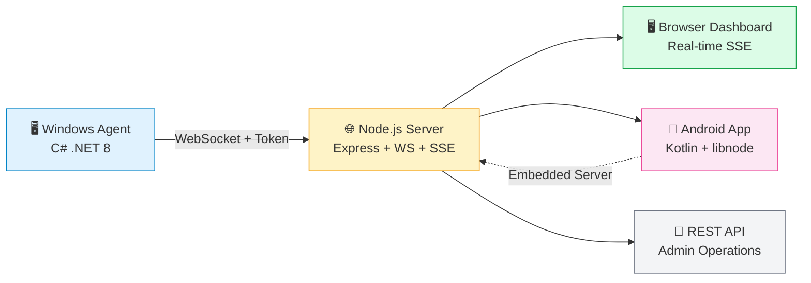

<p align="center">
  <a href="https://render.com/deploy?repo=https://github.com/4sudosu/WinSysMonitor">
    
  </a>
  <br><br>
  
  <br><br>
  <a href="https://github.com/4sudosu/WinSysMonitor/releases/latest">
    
  </a>
  <a href="https://github.com/4sudosu/WinSysMonitor/actions/workflows/android-release.yml">
    
  </a>
  <a href="https://github.com/4sudosu/WinSysMonitor/blob/main/LICENSE">
    
  </a>
  <a href="https://t.me/verifiedharyanvi">
    
  </a>
  <a href="https://github.com/4sudosu/WinSysMonitor/stargazers">
    
  </a>
  <a href="https://github.com/4sudosu/WinSysMonitor/forks">
    
  </a>
</p>

---

# 📡 WinSysMonitor — LAN System Monitoring

> **Monitor every Windows machine on your network from your phone or browser — no internet, no cloud, no subscription.**

A complete LAN monitoring system: lightweight Windows agents connect to a self-hosted Node.js server over WebSocket, serving a beautiful real-time dashboard. A native Kotlin Android app (with embedded Node.js runtime) lets you manage devices, capture live screenshots, and receive instant connect alerts — all on your local network.

---

## 🏗️ Architecture

<div align="center">

<svg width="800" height="500" viewBox="0 0 800 500" xmlns="http://www.w3.org/2000/svg">
  <!-- Background -->
  <rect width="800" height="500" fill="#f8fafc"/>
  
  <!-- Title -->
  <text x="400" y="30" text-anchor="middle" font-family="system-ui, sans-serif" font-size="20" font-weight="bold" fill="#1e293b">WinSysMonitor Architecture</text>
  
  <!-- Windows Agents Group -->
  <g transform="translate(50, 80)">
    <rect x="0" y="0" width="220" height="350" rx="12" fill="#e0f2fe" stroke="#0284c7" stroke-width="2"/>
    <text x="110" y="30" text-anchor="middle" font-family="system-ui, sans-serif" font-size="16" font-weight="bold" fill="#0284c7">🖥️ Windows Agents</text>
    <text x="110" y="55" text-anchor="middle" font-family="system-ui, sans-serif" font-size="12" fill="#0369a1">C# .NET 8 Service</text>
    
    <!-- Agent 1 -->
    <g transform="translate(20, 80)">
      <rect x="0" y="0" width="180" height="70" rx="8" fill="white" stroke="#0284c7" stroke-width="1.5"/>
      <text x="90" y="25" text-anchor="middle" font-family="system-ui, sans-serif" font-size="14" font-weight="600" fill="#0284c7">Agent 1</text>
      <text x="90" y="48" text-anchor="middle" font-family="system-ui, sans-serif" font-size="11" fill="#475569">ws://server:3001/ws/agent</text>
      <text x="90" y="63" text-anchor="middle" font-family="system-ui, sans-serif" font-size="10" fill="#64748b">Token Auth • Keepalive</text>
    </g>
    
    <!-- Agent 2 -->
    <g transform="translate(20, 170)">
      <rect x="0" y="0" width="180" height="70" rx="8" fill="white" stroke="#0284c7" stroke-width="1.5"/>
      <text x="90" y="25" text-anchor="middle" font-family="system-ui, sans-serif" font-size="14" font-weight="600" fill="#0284c7">Agent 2</text>
      <text x="90" y="48" text-anchor="middle" font-family="system-ui, sans-serif" font-size="11" fill="#475569">ws://server:3001/ws/agent</text>
      <text x="90" y="63" text-anchor="middle" font-family="system-ui, sans-serif" font-size="10" fill="#64748b">Auto-reconnect • 5s delay</text>
    </g>
    
    <!-- Agent N -->
    <g transform="translate(20, 260)">
      <rect x="0" y="0" width="180" height="70" rx="8" fill="white" stroke="#0284c7" stroke-width="1.5"/>
      <text x="90" y="25" text-anchor="middle" font-family="system-ui, sans-serif" font-size="14" font-weight="600" fill="#0284c7">Agent N</text>
      <text x="90" y="48" text-anchor="middle" font-family="system-ui, sans-serif" font-size="11" fill="#475569">ws://server:3001/ws/agent</text>
      <text x="90" y="63" text-anchor="middle" font-family="system-ui, sans-serif" font-size="10" fill="#64748b">Screenshot • HW Info</text>
    </g>
  </g>
  
  <!-- Server Group -->
  <g transform="translate(290, 80)">
    <rect x="0" y="0" width="220" height="350" rx="12" fill="#fef3c7" stroke="#f59e0b" stroke-width="2"/>
    <text x="110" y="30" text-anchor="middle" font-family="system-ui, sans-serif" font-size="16" font-weight="bold" fill="#f59e0b">🌐 Node.js Server</text>
    <text x="110" y="55" text-anchor="middle" font-family="system-ui, sans-serif" font-size="12" fill="#b45309">Express + WS + SSE</text>
    
    <!-- WebSocket Handler -->
    <g transform="translate(20, 80)">
      <rect x="0" y="0" width="180" height="60" rx="8" fill="white" stroke="#f59e0b" stroke-width="1.5"/>
      <text x="90" y="22" text-anchor="middle" font-family="system-ui, sans-serif" font-size="13" font-weight="600" fill="#f59e0b">WebSocket Server</text>
      <text x="90" y="40" text-anchor="middle" font-family="system-ui, sans-serif" font-size="10" fill="#78350f">Port 3001 • Token Validate</text>
      <text x="90" y="53" text-anchor="middle" font-family="system-ui, sans-serif" font-size="10" fill="#78350f">Agent Registry Map</text>
    </g>
    
    <!-- SSE Handler -->
    <g transform="translate(20, 160)">
      <rect x="0" y="0" width="180" height="60" rx="8" fill="white" stroke="#f59e0b" stroke-width="1.5"/>
      <text x="90" y="22" text-anchor="middle" font-family="system-ui, sans-serif" font-size="13" font-weight="600" fill="#f59e0b">SSE Endpoint</text>
      <text x="90" y="40" text-anchor="middle" font-family="system-ui, sans-serif" font-size="10" fill="#78350f">/events • Real-time</text>
      <text x="90" y="53" text-anchor="middle" font-family="system-ui, sans-serif" font-size="10" fill="#78350f">Device Updates</text>
    </g>
    
    <!-- REST API -->
    <g transform="translate(20, 240)">
      <rect x="0" y="0" width="180" height="60" rx="8" fill="white" stroke="#f59e0b" stroke-width="1.5"/>
      <text x="90" y="22" text-anchor="middle" font-family="system-ui, sans-serif" font-size="13" font-weight="600" fill="#f59e0b">REST Admin API</text>
      <text x="90" y="40" text-anchor="middle" font-family="system-ui, sans-serif" font-size="10" fill="#78350f">/api/* • Cookie Auth</text>
      <text x="90" y="53" text-anchor="middle" font-family="system-ui, sans-serif" font-size="10" fill="#78350f">Screenshot • Config</text>
    </g>
    
    <!-- Auth -->
    <g transform="translate(20, 320)">
      <rect x="0" y="0" width="180" height="60" rx="8" fill="white" stroke="#f59e0b" stroke-width="1.5"/>
      <text x="90" y="22" text-anchor="middle" font-family="system-ui, sans-serif" font-size="13" font-weight="600" fill="#f59e0b">Auth & Security</text>
      <text x="90" y="40" text-anchor="middle" font-family="system-ui, sans-serif" font-size="10" fill="#78350f">3-Strike Block</text>
      <text x="90" y="53" text-anchor="middle" font-family="system-ui, sans-serif" font-size="10" fill="#78350f">Brute-Force Protection</text>
    </g>
  </g>
  
  <!-- Clients Group -->
  <g transform="translate(530, 80)">
    <rect x="0" y="0" width="220" height="350" rx="12" fill="#dcfce7" stroke="#16a34a" stroke-width="2"/>
    <text x="110" y="30" text-anchor="middle" font-family="system-ui, sans-serif" font-size="16" font-weight="bold" fill="#16a34a">📱 Clients</text>
    
    <!-- Browser Dashboard -->
    <g transform="translate(20, 80)">
      <rect x="0" y="0" width="180" height="110" rx="8" fill="white" stroke="#16a34a" stroke-width="1.5"/>
      <text x="90" y="25" text-anchor="middle" font-family="system-ui, sans-serif" font-size="14" font-weight="600" fill="#16a34a">🖥️ Browser Dashboard</text>
      <text x="90" y="48" text-anchor="middle" font-family="system-ui, sans-serif" font-size="11" fill="#374151">SSE Real-time Updates</text>
      <text x="90" y="63" text-anchor="middle" font-family="system-ui, sans-serif" font-size="11" fill="#374151">10 Themes • Grid View</text>
      <text x="90" y="80" text-anchor="middle" font-family="system-ui, sans-serif" font-size="10" fill="#6b7280">Screenshot Viewer</text>
      <text x="90" y="95" text-anchor="middle" font-family="system-ui, sans-serif" font-size="10" fill="#6b7280">Admin Panel • Settings</text>
    </g>
    
    <!-- Android App -->
    <g transform="translate(20, 215)">
      <rect x="0" y="0" width="180" height="110" rx="8" fill="white" stroke="#16a34a" stroke-width="1.5"/>
      <text x="90" y="25" text-anchor="middle" font-family="system-ui, sans-serif" font-size="14" font-weight="600" fill="#16a34a">📱 Android App</text>
      <text x="90" y="48" text-anchor="middle" font-family="system-ui, sans-serif" font-size="11" fill="#374151">Native Kotlin • Material 3</text>
      <text x="90" y="63" text-anchor="middle" font-family="system-ui, sans-serif" font-size="11" fill="#374151">Embedded Node.js Server</text>
      <text x="90" y="80" text-anchor="middle" font-family="system-ui, sans-serif" font-size="10" fill="#6b7280">Notifications • 10 Themes</text>
      <text x="90" y="95" text-anchor="middle" font-family="system-ui, sans-serif" font-size="10" fill="#6b7280">6 Launcher Icons</text>
    </g>
    
    <!-- REST API Client -->
    <g transform="translate(20, 350)">
      <rect x="0" y="0" width="180" height="60" rx="8" fill="white" stroke="#16a34a" stroke-width="1.5"/>
      <text x="90" y="22" text-anchor="middle" font-family="system-ui, sans-serif" font-size="13" font-weight="600" fill="#16a34a">🔧 REST API Client</text>
      <text x="90" y="40" text-anchor="middle" font-family="system-ui, sans-serif" font-size="10" fill="#374151">Admin Operations</text>
      <text x="90" y="53" text-anchor="middle" font-family="system-ui, sans-serif" font-size="10" fill="#6b7280">Unlock • Config • Logs</text>
    </g>
  </g>
  
  <!-- Arrows: Agents -> Server -->
  <g stroke="#0284c7" stroke-width="2" fill="none" marker-end="url(#arrowhead)">
    <path d="M 270 180 Q 280 180 280 180"/>
    <path d="M 270 270 Q 280 270 280 270"/>
    <path d="M 270 360 Q 280 360 280 360"/>
    <text x="255" y="170" text-anchor="end" font-family="system-ui, sans-serif" font-size="9" fill="#0284c7">WebSocket</text>
    <text x="255" y="260" text-anchor="end" font-family="system-ui, sans-serif" font-size="9" fill="#0284c7">WebSocket</text>
    <text x="255" y="350" text-anchor="end" font-family="system-ui, sans-serif" font-size="9" fill="#0284c7">WebSocket</text>
  </g>
  
  <!-- Arrows: Server -> Dashboard (SSE) -->
  <g stroke="#16a34a" stroke-width="2" fill="none" marker-end="url(#arrowhead)">
    <path d="M 510 140 Q 520 140 520 140"/>
    <text x="525" y="135" font-family="system-ui, sans-serif" font-size="9" fill="#16a34a">SSE</text>
  </g>
  
  <!-- Arrows: Server -> Android (SSE) -->
  <g stroke="#16a34a" stroke-width="2" fill="none" marker-end="url(#arrowhead)">
    <path d="M 510 270 Q 520 270 520 270"/>
    <text x="525" y="265" font-family="system-ui, sans-serif" font-size="9" fill="#16a34a">SSE</text>
  </g>
  
  <!-- Arrow: Server -> REST Client -->
  <g stroke="#16a34a" stroke-width="2" fill="none" marker-end="url(#arrowhead)">
    <path d="M 510 380 Q 520 380 520 380"/>
    <text x="525" y="375" font-family="system-ui, sans-serif" font-size="9" fill="#16a34a">REST</text>
  </g>
  
  <!-- Embedded Server (Android -> Server) -->
  <g stroke="#ec4899" stroke-width="2" stroke-dasharray="5,5" fill="none" marker-end="url(#arrowhead)">
    <path d="M 530 270 Q 400 200 310 180"/>
    <text x="420" y="200" text-anchor="middle" font-family="system-ui, sans-serif" font-size="9" fill="#ec4899">Embedded Server</text>
  </g>
  
  <!-- Arrowhead marker -->
  <defs>
    <marker id="arrowhead" markerWidth="10" markerHeight="7" refX="9" refY="3.5" orient="auto">
      <polygon points="0 0, 10 3.5, 0 7" fill="#0284c7"/>
    </marker>
  </defs>
  
  <!-- Legend -->
  <g transform="translate(50, 450)">
    <circle cx="10" cy="10" r="6" fill="#e0f2fe" stroke="#0284c7" stroke-width="2"/>
    <text x="22" y="14" font-family="system-ui, sans-serif" font-size="11" fill="#475569">Windows Agent</text>
    <circle cx="150" cy="10" r="6" fill="#fef3c7" stroke="#f59e0b" stroke-width="2"/>
    <text x="162" y="14" font-family="system-ui, sans-serif" font-size="11" fill="#475569">Node.js Server</text>
    <circle cx="320" cy="10" r="6" fill="#dcfce7" stroke="#16a34a" stroke-width="2"/>
    <text x="332" y="14" font-family="system-ui, sans-serif" font-size="11" fill="#475569">Clients</text>
  </g>
</svg>

</div>

> 📱 **Phone can ALSO host the server** — Start Server → `0.0.0.0` (LAN) or `127.0.0.1` (local)

### System Overview

| Component | Technology | Purpose |
|-----------|------------|---------|
| **Windows Agent** | C# (.NET 8) | 24×7 service, WebSocket client, hardware monitoring, screenshots |
| **Node.js Server** | Express + WS + SSE | Real-time dashboard, agent management, REST API, auth |
| **Web Dashboard** | HTML/CSS/JS | 10 themes, live device grid, screenshot viewer, admin panel |
| **Android App** | Kotlin + Material 3 | Native UI, embedded server, notifications, 10 themes |

### Data Flow



> 📱 **Phone can ALSO host the server** — Start Server → `0.0.0.0` (LAN) or `127.0.0.1` (local)

---

## 📸 Screenshots

### 📱 Android App — Native Kotlin + Material 3

<div align="center">

| Launcher | Devices | Device Detail | Settings |
|:--------:|:-------:|:-------------:|:--------:|
|  |  |  |  |

</div>

### 🌐 Web Dashboard — 10 Themes, Real-time SSE

<div align="center">

> 📸 **Screenshots needed** — Add these to `docs/screenshots/`:
> - `dashboard.png` — Main dashboard view
> - `login.png` — Admin login page  
> - `device-table.png` — Device list/table view
> - `screenshot-modal.png` — Screenshot zoom modal

| Dashboard | Login | Device Table | Screenshot Modal |
|:---------:|:-----:|:------------:|:----------------:|
|  |  |  |  |

</div>

### 🎨 Theme Gallery

<div align="center">

<svg width="800" height="320" viewBox="0 0 800 320" xmlns="http://www.w3.org/2000/svg">
  <rect width="800" height="320" fill="#f8fafc"/>
  <text x="400" y="25" text-anchor="middle" font-family="system-ui, sans-serif" font-size="18" font-weight="bold" fill="#1e293b">10 Dashboard Themes</text>
  <text x="400" y="45" text-anchor="middle" font-family="system-ui, sans-serif" font-size="12" fill="#64748b">Matches Android app themes • Persists in localStorage</text>
  
  <!-- Theme definitions: [name, bg, card, accent, text] -->
  <g id="themes"></g>
</svg>

<script>
  const themes = [
    ["Midnight Ocean", "#0f172a", "#1e293b", "#06b6d4", "#f1f5f9"],
    ["Aurora", "#0c1a2b", "#14263d", "#22d3ee", "#e0f2fe"],
    ["Solar Flare", "#2c1a00", "#3d2a0a", "#fbbf24", "#fef3c7"],
    ["Cyberpunk", "#0a0a1a", "#1a1a2e", "#a855f7", "#e9d5ff"],
    ["Royal Purple", "#1a0a2e", "#2d1a3d", "#c084fc", "#f3e8ff"],
    ["Forest Calm", "#0a1a0a", "#1a2e1a", "#22c55e", "#dcfce7"],
    ["Slate Pro", "#18181b", "#27272a", "#71717a", "#fafafa"],
    ["Paper Light", "#fafafa", "#ffffff", "#3b82f6", "#1e293b"],
    ["Mint Fresh", "#f0fdf4", "#ffffff", "#10b981", "#064e3b"],
    ["Rose Blush", "#fdf2f8", "#ffffff", "#ec4899", "#831843"]
  ];
  
  const svg = document.getElementById('themes');
  const cardW = 72, cardH = 100, gap = 12;
  const startX = (800 - (10 * cardW + 9 * gap)) / 2;
  const startY = 70;
  
  themes.forEach((t, i) => {
    const x = startX + i * (cardW + gap);
    const y = startY;
    const g = document.createElementNS('http://www.w3.org/2000/svg', 'g');
    g.setAttribute('transform', `translate(${x}, ${y})`);
    
    // Card background
    const card = document.createElementNS('http://www.w3.org/2000/svg', 'rect');
    card.setAttribute('x', '0'); card.setAttribute('y', '0');
    card.setAttribute('width', cardW); card.setAttribute('height', cardH);
    card.setAttribute('rx', '8'); card.setAttribute('fill', t[1]); card.setAttribute('stroke', t[3]); card.setAttribute('stroke-width', '2');
    g.appendChild(card);
    
    // Top bar
    const bar = document.createElementNS('http://www.w3.org/2000/svg', 'rect');
    bar.setAttribute('x', '4'); bar.setAttribute('y', '4');
    bar.setAttribute('width', cardW - 8); bar.setAttribute('height', '18');
    bar.setAttribute('rx', '4'); bar.setAttribute('fill', t[2]); bar.setAttribute('stroke', t[3]); bar.setAttribute('stroke-width', '1');
    g.appendChild(bar);
    
    // Window buttons
    ['#ef4444', '#fbbf24', '#22c55e'].forEach((c, j) => {
      const btn = document.createElementNS('http://www.w3.org/2000/svg', 'circle');
      btn.setAttribute('cx', 10 + j * 12); btn.setAttribute('cy', 13); btn.setAttribute('r', 4); btn.setAttribute('fill', c);
      g.appendChild(btn);
    });
    
    // Device cards
    for (let r = 0; r < 3; r++) {
      const row = document.createElementNS('http://www.w3.org/2000/svg', 'rect');
      row.setAttribute('x', '6'); row.setAttribute('y', 30 + r * 22);
      row.setAttribute('width', cardW - 12); row.setAttribute('height', '18');
      row.setAttribute('rx', '4'); row.setAttribute('fill', t[2]); row.setAttribute('stroke', t[3]); row.setAttribute('stroke-width', '0.5');
      row.setAttribute('opacity', r === 0 ? '1' : '0.7');
      g.appendChild(row);
      
      // Status dot
      const dot = document.createElementNS('http://www.w3.org/2000/svg', 'circle');
      dot.setAttribute('cx', 12); dot.setAttribute('cy', 39 + r * 22); dot.setAttribute('r', 4);
      dot.setAttribute('fill', r === 0 ? '#22c55e' : '#fbbf24');
      g.appendChild(dot);
    }
    
    // Theme name
    const name = document.createElementNS('http://www.w3.org/2000/svg', 'text');
    name.setAttribute('x', cardW/2); name.setAttribute('y', cardH + 18);
    name.setAttribute('text-anchor', 'middle'); name.setAttribute('font-family', 'system-ui, sans-serif');
    name.setAttribute('font-size', '10'); name.setAttribute('font-weight', '600'); name.setAttribute('fill', '#334155');
    name.textContent = t[0];
    g.appendChild(name);
    
    svg.appendChild(g);
  });
</script>

</div>

> 📸 **Screenshots needed** — Add these to `docs/screenshots/` to replace placeholders:
> - `banner.png` — Project banner (800×400)
> - `dashboard.png` — Main dashboard view
> - `login.png` — Admin login page  
> - `device-table.png` — Device list/table view
> - `screenshot-modal.png` — Screenshot zoom modal

---

## ✨ Features

<div align="center">

| 📱 Android App | 🖥️ Windows Agent | 🌐 Server & Dashboard | 🔐 Security |
|:---:|:---:|:---:|:---:|
| Native Kotlin + Material 3 | 24×7 Windows Service | Real-time SSE Updates | Token-based Agent Auth |
| Embedded Node.js Runtime | Silent Installer + ACL | 10 Beautiful Themes | 3-Strike Device Block |
| 10 Themes + 6 Icons | Config Auto-Reload | Admin Cookie Sessions | Brute-Force Protection |
| Live Screenshots | Secure GDI Capture | REST Admin API | TLS/WSS Support |

</div>

### 📱 Android App — Native Experience

| Feature | Description |
|---------|-------------|
| 🚀 **Mandatory Update Gate** | Checks GitHub releases on startup, blocks UI until verified |
| 🎨 **Native Material 3 UI** | Kotlin + Jetpack Compose — no WebView for main flow |
| 📡 **Live Device List** | Real-time SSE updates, search/filter by hostname, IP, serial, model |
| 📸 **Screenshot Capture** | One-tap full-screen capture, zoom/pan, save/copy/share |
| ⏱️ **Auto-Refresh** | Configurable 3s / 5s / 10s per device |
| 🔔 **Connect Alerts** | Native notification + custom sound/icon when agent connects |
| 🌈 **10 Themes** | Midnight Ocean, Aurora, Solar Flare, Cyberpunk, Royal Purple, Forest Calm, Slate Pro, Paper Light, Mint Fresh, Rose Blush |
| 🎯 **6 Launcher Icons** | Default, Emerald, Violet, Rose, Amber, Ocean (adaptive) |
| 🔊 **Custom Notifications** | Pick tone (system/chime/alert/ding/soft/custom) + icon |
| 🏠 **Host or Connect** | Run server on phone (`127.0.0.1` or `0.0.0.0`) or connect to external |

### 🖥️ Windows Agent — Enterprise Grade

| Feature | Description |
|---------|-------------|
| ⚙️ **24×7 Windows Service** | Runs as LocalSystem, auto-restart on crash (`sc failure`) |
| 🤫 **Silent Install** | `/VERYSILENT /SERVERIP=x /SERVERPORT=y /SERVERTOKEN=z` |
| 🔄 **Config Auto-Reload** | Edit `agent.config.json` → agent reconnects instantly |
| 🔒 **Config ACL Lock** | `icacls` → only SYSTEM + Admins can modify |
| 📷 **Secure Screenshots** | Scheduled task in user session (no Service Desktop access) |
| 🎯 **Dual Capture** | Direct GDI first, fallback to PowerShell interactive |

### 🌐 Server & Dashboard — Real-time Control

| Feature | Description |
|---------|-------------|
| ⚡ **Real-time SSE** | Live agent connect/disconnect, device list updates |
| 🎨 **10 Dashboard Themes** | Matches Android themes, persists in localStorage |
| 🔐 **Admin Auth** | Cookie sessions (7-day) + `X-Admin-Password` header |
| 🛡️ **Brute-Force Protection** | 3 failed logins → server locks until restart |
| 🚫 **Device Blocking** | 3-strike strict block (passwords ignored while blocked) |
| 📸 **Screenshot API** | `POST /api/monitor/:machine/screenshot` → base64 PNG |
| ⚙️ **Config API** | `/api/config` for server info, `/api/agents` for device list |
| 🌐 **CORS/Origin Control** | Locked to configured origins |
| 📦 **Payload Limits** | 200MB max for screenshots |

### 🔐 Security — Defense in Depth

| Layer | Implementation |
|-------|----------------|
| 🔑 **Agent → Server** | Shared token (WebSocket query param) |
| 🍪 **Admin → Dashboard** | Password (cookie) or `X-Admin-Password` header |
| 📁 **Agent Config** | ACL-locked to SYSTEM + Administrators |
| 🔒 **Transport** | WSS on 443 (TLS), WS on LAN |
| ✅ **Update Security** | Fixed keystore, mandatory signature verification |
| 🔐 **Dashboard Lock** | 3 failed logins → server lock until restart |
| 🚫 **Device Block** | 3 wrong passwords → strict block (dashboard unlock only) |

---

## 🚀 Deployment Options

### Option 1: Render.com (Free TLS, Auto-sleep) ⭐ **Recommended**

[](https://render.com/deploy?repo=https://github.com/4sudosu/WinSysMonitor)

```yaml
# render.yaml (included in repo)
services:
  - type: web
    name: winsys-monitor-server
    runtime: node
    plan: free
    rootDir: Server
    buildCommand: npm install
    startCommand: npm start
    healthCheckPath: /api/health
    envVars:
      - key: ADMIN_PASSWORD
        sync: false          # you will be asked to enter this during deploy
      - key: PORT
        value: "10000"
```

**One-click deploy:** Click the button above → Connect GitHub → Enter `ADMIN_PASSWORD` → Done!

- ✅ Free tier with 750 hrs/month
- ✅ Automatic HTTPS (TLS) on `.onrender.com`
- ✅ Auto-sleep on inactivity, instant wake
- ✅ Agents connect: `wss://your-app.onrender.com/ws/agent` (port 443 = auto TLS)

---

### Option 2: VPS / Cloud VM (Full Control)

```bash
# Ubuntu/Debian
apt update && apt install -y nodejs npm
git clone https://github.com/4sudosu/WinSysMonitor
cd WinSysMonitor/Server && npm install
ADMIN_PASSWORD="your-strong-password" node server.js
# Dashboard: http://your-ip:3001
# Agents: ws://your-ip:3001/ws/agent
```

| Provider | Est. Cost | Notes |
|----------|-----------|-------|
| **Hetzner CX22** | ~€4/mo | Best price/performance |
| **DigitalOcean** | ~$6/mo | Simple setup |
| **AWS Lightsail** | ~$5/mo | Easy management |
| **Oracle Cloud** | Free tier | 4 ARM cores, 24GB RAM |

---

### Option 3: Local LAN (Phone or PC)

| Platform | Command |
|----------|---------|
| **📱 Phone** | App → 🚀 **Start Server** (`127.0.0.1`) or 🌐 **Run on `0.0.0.0`** |
| **💻 PC** | `cd Server && npm install && node server.js` |
| **🖥️ Agents** | Connect to LAN IP: `ws://192.168.x.x:3001/ws/agent` |

> 💡 **Pro tip:** Run server on phone (`0.0.0.0`) + agents on LAN = fully portable monitoring!

---

## 🔨 Build From Source

### Prerequisites

| Component | Requirement | Link |
|-----------|-------------|------|
| **Agent Build** | Windows 10+, .NET 8 SDK | [Download](https://dotnet.microsoft.com/download/dotnet/8.0) |
| **Agent Installer** | Inno Setup 6 | [Download](https://jrsoftware.org/isdl.php) |
| **Android App** | JDK 17, Android SDK (compileSdk 34), CMake 3.22.1, `libnode` | [Android Studio](https://developer.android.com/studio) |
| **Server** | Node.js 18+ | [Download](https://nodejs.org/) |

---

### 📱 Android App (v1.1.33)

```bash
# Set paths in Android/local.properties (gitignored)
sdk.dir=C:\path\to\android-sdk
cmake.dir=C:\path\to\cmake-3.22.1

cd Android
./gradlew assembleDebug
# → Android/app/build/outputs/apk/debug/app-debug.apk

# Release (requires keystore in GitHub Secrets)
./gradlew assembleRelease \
  -PversionName=1.1.33 -PversionCode=33 \
  -PreleaseStoreFile=keystore.jks -PreleaseStorePassword=xxx \
  -PreleaseKeyAlias=winsysmonitor -PreleaseKeyPassword=xxx
```

### 🖥️ Windows Agent + Installer (v1.0.0.2)

```powershell
# One command: dotnet publish → Inno Setup 6
./build-agent.ps1
# → installer-output\WinSysMonitor-Setup-1.0.0.2.exe
```

### 🌐 Server (Development)

```bash
cd Server
npm install
node server.js        # http://0.0.0.0:3001
# Env overrides: HOST=0.0.0.0 PORT=3001 ADMIN_PASSWORD=xxx
```

---

## 📁 Repository Structure

```
WinSysMonitor/
├── .github/workflows/
│   └── android-release.yml    # CI/CD: build + sign + release
├── Agent/                     # 🪟 C# (.NET 8) Windows Agent
│   ├── AgentClient.cs         # WebSocket + reconnect + keepalive
│   ├── AgentService.cs        # Windows service host
│   ├── DeviceInfo.cs          # HW/OS/Network collection
│   ├── ScreenCapture.cs       # GDI + PowerShell fallback
│   ├── PowerShellRunner.cs    # Interactive scheduled task
│   ├── AgentConfig.cs         # Config loading (auto-reload)
│   ├── Program.cs             # Entry (service / --capture / --service)
│   ├── WinSysMonitor.csproj
│   └── agent.config.json      # Runtime config (gitignored)
│
├── Android/                   # 📱 Kotlin Android App
│   ├── app/
│   │   ├── build.gradle       # compileSdk 34, minSdk 26, versionCode 33
│   │   ├── src/main/
│   │   │   ├── assets/nodejs-project/  # Bundled Node.js server
│   │   │   ├── java/com/wsmonitor/app/
│   │   │   │   ├── LauncherActivity.kt    # Update gate + server control
│   │   │   │   ├── MainActivity.kt        # Devices + settings tabs
│   │   │   │   ├── ConnectActivity.kt     # 3-attempt block + unlock
│   │   │   │   ├── DeviceDetailActivity.kt# Screenshot viewer
│   │   │   │   ├── UpdateChecker.kt       # GitHub API version check
│   │   │   │   ├── UpdateActivity.kt      # DownloadManager install
│   │   │   │   ├── NodeService.kt         # Foreground service + libnode
│   │   │   │   ├── ServerConfig.kt        # Config + block state
│   │   │   │   ├── AppPrefs.kt            # Theme/icon/sound prefs
│   │   │   │   └── AgentEventService.kt   # SSE listener + notifications
│   │   │   └── res/               # Layouts, themes, icons, XML
│   │   └── proguard-rules.pro
│   ├── gradle/wrapper/
│   └── settings.gradle
│
├── Server/                    # 🌐 Node.js Server + Dashboard
│   ├── server.js              # Express + WS + SSE + REST
│   ├── package.json
│   └── dashboard/
│       ├── index.html         # Main dashboard (10 themes, SSE)
│       ├── login.html         # Admin login (brute-force protected)
│       ├── app.js             # Theme, devices, screenshots, settings
│       └── style.css          # CSS variables for theming
│
├── Installer/
│   └── installer.iss          # Inno Setup: service + ACL + config
│
├── build-agent.ps1            # Build agent + installer
├── bundle-server.ps1          # Portable node.exe + server
├── launcher.ps1               # Dev server launcher
├── render.yaml                # Render.com Blueprint
├── release.keystore           # Android signing keystore (base64 in secrets)
├── docs/screenshots/          # App & dashboard screenshots
├── README.md
├── START.md                   # AI quick start
├── REPOSITORY_GUIDE.md        # Architecture + CI/CD + roadmap
└── RECENT_CHANGES.md          # Complete change history
```

---

## 🔧 Configuration

### 🖥️ Agent (`agent.config.json`)

```json
{
  "ServerUrl": "ws://192.168.1.50:3001/ws/agent",
  "Token": "SHARED_SECRET_TOKEN",
  "ReconnectDelaySec": 5,
  "KeepAliveSec": 20
}
```

| Property | Description |
|----------|-------------|
| `ServerUrl` | WebSocket endpoint (use `wss://` for TLS) |
| `Token` | Shared secret for agent authentication |
| `ReconnectDelaySec` | Seconds between reconnection attempts |
| `KeepAliveSec` | Heartbeat interval to detect disconnection |

- 🔄 **Auto-reloads** on file change (watched by service)
- 🔒 **ACL-locked**: only SYSTEM + Administrators can edit

---

### 🌐 Server (Environment Variables)

| Variable | Default | Description |
|----------|---------|-------------|
| `ADMIN_PASSWORD` | `Alok@1234` | **⚠️ Change in production!** Dashboard + API password |
| `PORT` | `3001` | HTTP + WebSocket port |
| `HOST` | `0.0.0.0` | Bind address (`0.0.0.0` = all interfaces) |

---

### 📱 Android App (SharedPreferences)

| Setting | Description |
|---------|-------------|
| Server URL + Mode | Host (`0.0.0.0`/`127.0.0.1`) or Connect to external |
| Admin Password | For server authentication |
| Theme | 10 beautiful themes |
| Notification Tone/Icon | Custom sound + icon for alerts |
| Launcher Icon | 6 adaptive icon variants |
| Device Block State | Persists across app restarts |

---

## 🔐 Security Deep Dive

### 🛡️ 3-Strike Device Block (Strict)

```mermaid
graph TD
    A[Agent Connects] --> B{Wrong Password?}
    B -->|Yes| C[Attempt 1/2]
    C --> D{Attempts < 3?}
    D -->|Yes| E[401 { attemptsLeft: 2, 1 }]
    D -->|No| F[403 { deviceBlocked: true }]
    F --> G[Server: adds to blockedDevices Map]
    G --> H[Client: locks UI, shows '🔓 Check Status']
    H --> I[Only Dashboard Unlock Clears It]
    B -->|No| J[Allow Connection]
    style F fill:#fee2e2,stroke:#ef4444
    style I fill:#fef3c7,stroke:#f59e0b
```

---

### 🔒 Admin Dashboard Brute-Force Protection

```mermaid
graph TD
    A[POST /api/login] --> B{Wrong Password?}
    B -->|Yes| C[Attempt 1/2]
    C --> D{Attempts < 3?}
    D -->|Yes| E[403 { attemptsLeft: 2, 1 }]
    D -->|No| F[423 { error: 'locked', message: 'Restart server to unlock' }]
    F --> G[loginLocked = true until process restart]
    B -->|No| H[200 OK + Cookie Session]
    style F fill:#fee2e2,stroke:#ef4444
    style G fill:#fef3c7,stroke:#f59e0b
```

---

### 📁 Config ACL (Windows Installer)

```cmd
icacls "C:\Program Files\WinSysMonitor\agent.config.json" ^
  /inheritance:r ^
  /grant:r "SYSTEM:(F)" "Administrators:(F)" "BUILTIN\Users:(R)"
```

| Permission | Principal | Access |
|------------|-----------|--------|
| `(F)` | SYSTEM | Full Control |
| `(F)` | Administrators | Full Control |
| `(R)` | BUILTIN\Users | Read Only |

> 🔐 **Result:** Standard users cannot modify agent configuration — only admins and the service itself.

---

## 📦 Releases

| Platform | Asset | Version | Notes |
|----------|-------|---------|-------|
| 📱 **Android** | `WinSysMonitor-v1.1.33.apk` | 1.1.33 (code 33) | Signed, mandatory update gate |
| 🖥️ **Windows** | `WinSysMonitor-Setup-1.0.0.2.exe` | 1.0.0.2 | Best working installer |

<div align="center">

[](https://github.com/4sudosu/WinSysMonitor/releases/latest)

</div>

---

## 🛣️ Roadmap

<div align="center">

| 🔴 High | 🟡 Medium | 🟢 Low |
|:---|:---|:---|
| `workflow_dispatch` trigger | Play Store deployment | Signed agent releases via CI |
| `setup-java@v5` migration | Delta updates | Auto version bump |
| GitHub token for UpdateChecker | Beta/stable channels | Slack notifications |

</div>

---

## 🤝 Contributing

We welcome contributions! Here's how to get started:

### Quick Start

```bash
# 1. Fork the repo
# 2. Clone your fork
git clone https://github.com/YOUR_USERNAME/WinSysMonitor
cd WinSysMonitor

# 3. Create feature branch
git checkout -b feature/amazing-feature

# 4. Make changes & commit
git commit -m 'Add amazing feature'

# 5. Push & open PR
git push origin feature/amazing-feature
```

### Guidelines

- 📝 **Documentation**: Update `RECENT_CHANGES.md` + `REPOSITORY_GUIDE.md` + `START.md` after ANY change
- ✅ **Tests**: Ensure all CI checks pass
- 🎨 **Code Style**: Follow existing patterns in each component
- 🔒 **Security**: Never commit secrets or keys

---

## 📄 License

<div align="center">

**MIT License** — see [LICENSE](LICENSE) for details.

[](LICENSE)

</div>

---

## 🙏 Credits & Contact

<div align="center">

| | |
|:---|:---|
| **👨‍💻 Author** | 4sudo.su ([@4sudosu](https://github.com/4sudosu)) |
| **📱 Telegram** | [@verifiedharyanvi](https://t.me/verifiedharyanvi) |
| **📧 Email** | 4sudo.su@gmail.com |
| **🎨 Android Icons** | Material Design Icons |
| **🎭 Dashboard Themes** | Custom CSS variables |
| **⚡ Node.js Runtime** | [nodejs-mobile](https://github.com/janeasystems/nodejs-mobile) |

</div>

---

<div align="center">

**Built with ❤️ for trusted LANs — no cloud, no subscription, no tracking.**

<br><br>

[](https://github.com/4sudosu/WinSysMonitor/releases/latest)
[](https://github.com/4sudosu/WinSysMonitor)
[](https://t.me/verifiedharyanvi)

<br><br>

*Made with care by [4sudo.su](https://github.com/4sudosu)*

</div>