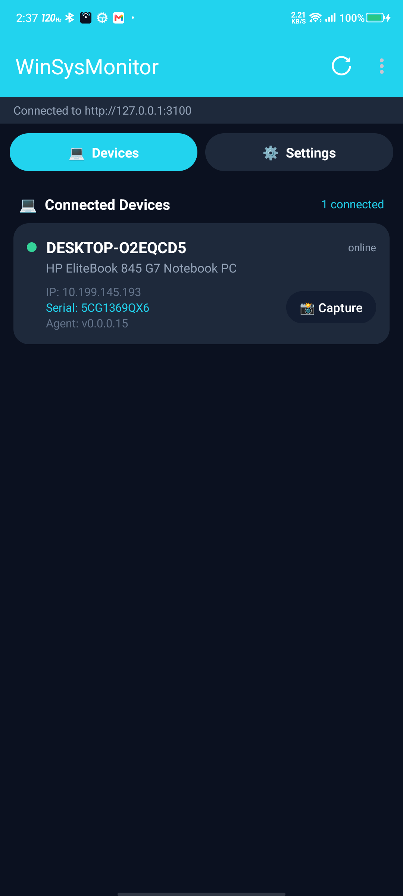
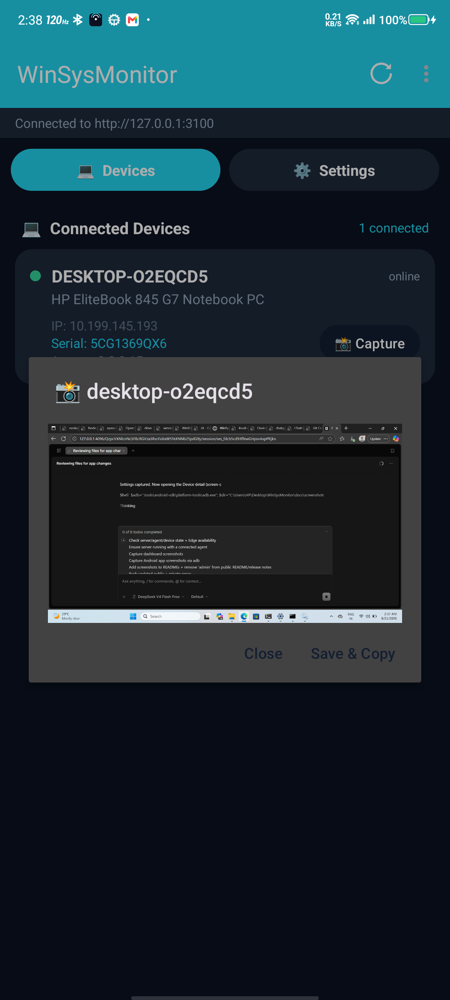
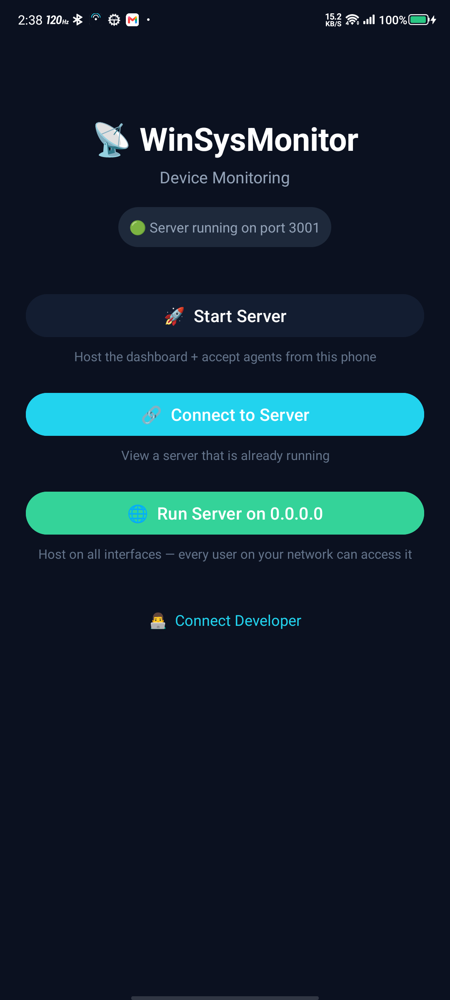
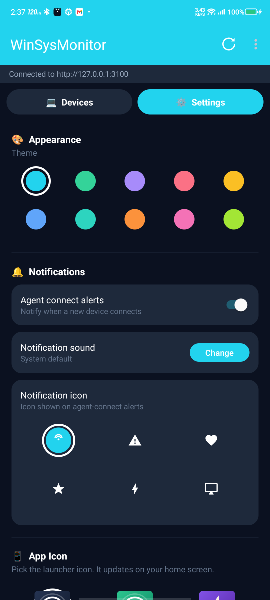

# WinSysMonitor 📡

Monitor Windows machines from your phone. A lightweight agent runs on each PC as a 24x7 Windows service, connects to the server over WebSocket, and lets you grab live screenshots from the Android app or the web dashboard.

| Devices | Device detail |
|---------|---------------|
|  |  |

| Launcher | Settings |
|----------|----------|
|  |  |

---

## 📦 Downloads (`apps/`)

| File | What it is |
|------|------------|
| `WinSysMonitor-Agent-Setup.exe` | Windows agent installer (background service, auto-restart) |
| `WinSysMonitor-latest.apk` | Android app — host a server on the phone or connect to one |

---

## 🖥️ Run the server (local / VPS)

Requires [Node.js](https://nodejs.org) 18+.

```bash
cd Server
npm install

# REQUIRED — set your own dashboard password before starting!
set ADMIN_PASSWORD=YourSecretPassword      # Windows
export ADMIN_PASSWORD=YourSecretPassword   # Linux / macOS

npm start
```

Dashboard opens at `http://localhost:3001/login`.

### ⚙️ Environment variables

| Variable | Required | Default | Description |
|----------|----------|---------|-------------|
| `ADMIN_PASSWORD` | ✅ yes | `changeme` | Password for the web dashboard login **and** the API (app uses it too). Always set your own. |
| `PORT` | optional | `3001` | HTTP + WebSocket port |
| `HOST` | optional | `0.0.0.0` | Bind address (`0.0.0.0` = all interfaces) |

> The dashboard locks itself for **3 failed login attempts** — restart the server to unlock.

---

## ☁️ Deploy free on Render.com

This repo includes a ready [`render.yaml`](render.yaml) blueprint.

### Option A — Blueprint (recommended)

1. Push this repo (or fork it) to your own GitHub
2. On [dashboard.render.com](https://dashboard.render.com): **New → Blueprint** → pick the repo
3. Render reads `render.yaml` and asks you for:
   - `ADMIN_PASSWORD` → enter a strong secret — this is your dashboard password
4. Click **Apply** — done in ~2 minutes

### Option B — Manual Web Service

1. **New → Web Service** → connect the repo
2. Configure exactly like this:

   | Setting | Value |
   |---------|-------|
   | Root Directory | `Server` |
   | Runtime | Node |
   | Build Command | `npm install` |
   | Start Command | `npm start` |

3. **Environment tab → Add:**
   - `ADMIN_PASSWORD` = your secret password
4. Create & deploy

### After deploy

- Dashboard: `https://your-app.onrender.com/login`
- Agents connect with hostname `your-app.onrender.com`, port `443` (TLS is used automatically on 443)
- Render free tier sleeps when idle — the first page load wakes it up (~30 s)

> 💡 Enable **Auto-Deploy on Push** in Render settings so every `git push` deploys automatically.
>
> ⚠️ Login sessions are kept in memory — a Render restart/redeploy logs you out and clears the lockout counter.

---

## 🪟 Install the agent (Windows)

Run `apps/WinSysMonitor-Agent-Setup.exe` as Administrator. The wizard asks for:

| Field | Example | Notes |
|-------|---------|-------|
| Server IP / hostname | `192.168.1.50` or `your-app.onrender.com` | Where the server runs |
| Port | `3001` LAN · `443` Render | TLS (`wss://`) is automatic on port 443 |
| Agent token | any shared secret | Must be non-empty; agents identify with it |

The installer will:

- Install to `C:\Program Files\WinSysMonitor` (always this path)
- Register an auto-start **Windows service** ("Windows System Monitor") running as LocalSystem — works 24x7 even with nobody logged in
- Add crash recovery (auto-restart on failure)
- Lock `agent.config.json` so only SYSTEM/Administrators can edit it

Silent install for automation:

```bat
WinSysMonitor-Agent-Setup.exe /VERYSILENT /SERVERIP=your-server /SERVERPORT=443 /SERVERTOKEN=my-token
```

Uninstalling removes the service and all files. Config changes (server IP etc.) can be made anytime by editing `C:\Program Files\WinSysMonitor\agent.config.json` as admin — the agent reloads it automatically.

---

## 📱 Android app

Install `apps/WinSysMonitor-latest.apk` (enable "install unknown apps" if asked).

**Two modes:**

| Mode | Use it when | Setup |
|------|-------------|-------|
| **Host** | You want the phone to BE the server (LAN) | Launcher → Start Server → enter port |
| **Connect** | You have a server elsewhere (Render/VPS/PC) | Launcher → Connect → host, port, **admin password** |

Features: live device list, instant screenshot capture, auto-refresh (3s/5s/10s), save/copy/share screenshots, new-device alerts with custom sounds & icons, themes and app icons.

> If the saved password is ever rejected the app tells you immediately and lets you retry with a different one — no "unreachable" confusion.

---

## 🔒 Security notes

- Set a strong `ADMIN_PASSWORD` — never run the dashboard publicly with the default
- Dashboard auto-locks after **3 wrong passwords** until the server restarts
- Agent config is ACL-locked to SYSTEM/Administrators only
- Agents and dashboard use separate secrets (agent token vs admin password)

## 🛠️ Troubleshooting

| Problem | Fix |
|---------|-----|
| Dashboard says locked | Restart the service (Render: Manual Deploy/Restart) |
| App shows "wrong password" | Tap the dialog and enter the correct admin password |
| App shows "unreachable" | Server down/sleeping — open the dashboard URL once to wake Render |
| Agent offline in list | Check token non-empty and server URL/port; agent log: `C:\Program Files\WinSysMonitor\agent.service.log` |
| Can't capture screenshot | Agent must be online; check service is Running (`sc query WinSysMonitor`) |

---

Built by [4sudo.su](https://github.com/4sudosu) · Telegram [@verifiedharyanvi](https://t.me/verifiedharyanvi)
